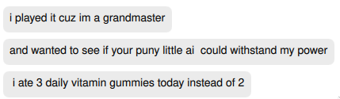

# Connect Four C
Connect Four written in C to practice C

# Todo
- [X] Write Connect Four
- [X] Write AI (https://en.wikipedia.org/wiki/Minimax)
- [X] Write alpha-beta pruning optimisation
- [ ] Further heuristic optimisations
- [ ] GUI Game

# Usage
```
$ ./build.sh
$ ./twoplayer or ./ai
```

# Contributions
 - [@beepboopblap](https://github.com/beepboopblap) - Played the game for a while because he's a "Grandmaster in Connect Four."

